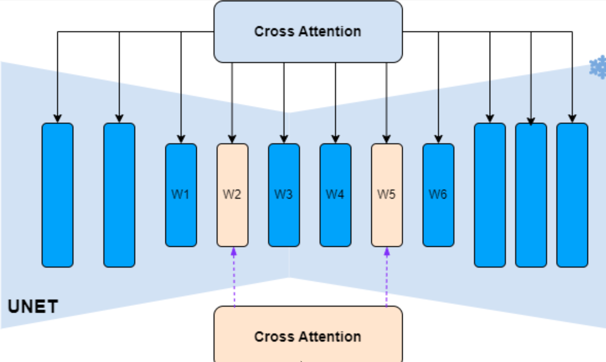
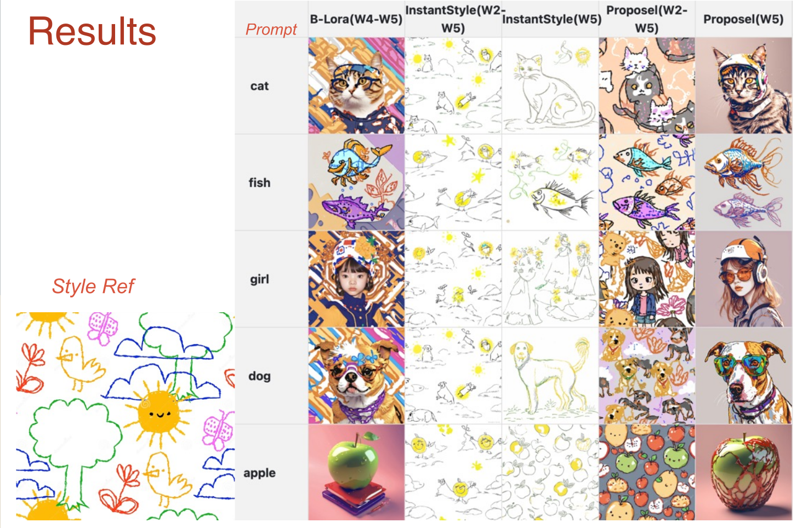
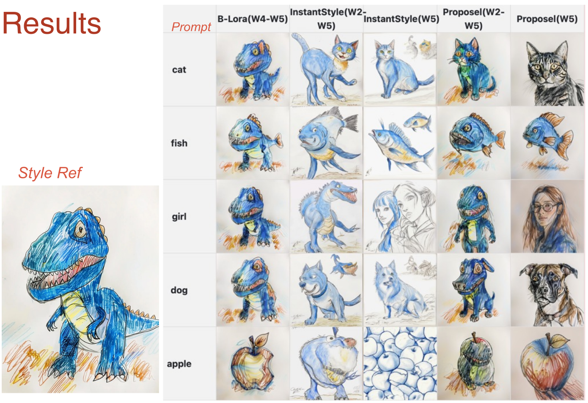
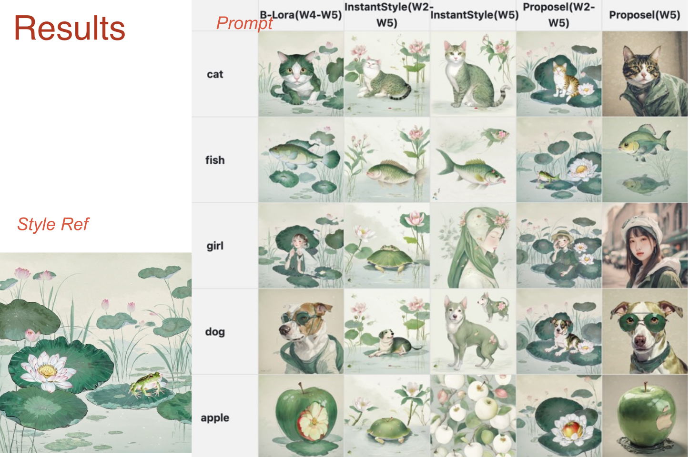

# Improved B-LoRA for Style Preservation and Transformation



The objective of this repository is to enhance B-LoRA based on insights from InstantStyle, with a focus on layers 2 and 5 to improve style preservation and transformation. This approach uses a single photo as the style reference to ensure consistent style application across various content prompts.


## Getting Started

### Installation

1. Clone this repository:
   ```
   git clone https://github.com/RongWenYin/improved_blora.git
   cd improved_blora
   ```

2. Install the required dependencies:
   ```
   pip install -r requirements.txt
   ```

### Usage

1. **Training Improved Improved B-LoRAs**

   To train the Improved Improved B-LoRAs for a given input image, run:
   ```
   !accelerate launch train_dreambooth_b-lora_sdxl.py \
    --pretrained_model_name_or_path="stabilityai/stable-diffusion-xl-base-1.0" \
    --instance_data_dir="./images/{styleKey}" \
    --output_dir="{output_dir}" \
    --instance_prompt="{promptKey}" \
    --resolution=1024 \
    --rank=64 \
    --train_batch_size=1 \
    --learning_rate=5e-5 \
    --lr_scheduler="constant" \
    --lr_warmup_steps=0 \
    --max_train_steps=1000 \
    --checkpointing_steps=1000 \
    --seed="0" \
    --gradient_checkpointing \
    --use_8bit_adam \
    --mixed_precision="fp16" \
    --cust_block_list="down_blocks.2.attentions.0 down_blocks.2.attentions.1 mid_block.attentions.0 up_blocks.0.attentions.0 up_blocks.0.attentions.1 up_blocks.0.attentions.2"

      ```
This will optimize the Improved B-LoRAs weights for the style and store them in  `output_dir`.
Parameters that need to replace  `instance_data_dir`, `output_dir`, `instance_prompt` (in our paper we use `A [v]`)


2. **Inference**   

   For image stylization based on a reference style image (1), run:
   ```
   from utils import *
   # Use all selected layers combined for a comprehensive style effect
   layer_list = ['W1', 'W2', 'W3', 'W4', 'W5', 'W6', 
               'W1_W2', 'W1_W3', 'W1_W4', 'W1_W5', 'W1_W6', 
               'W2_W3', 'W2_W4', 'W2_W5', 'W2_W6', 
               'W3_W4', 'W3_W5', 'W3_W6', 
               'W4_W5', 'W4_W6', 'W5_W6']  # Full range of layer combinations for extensive style customization
   object_names = ["girl", "cat", "apple", "dog", "fish"]
   # The inferenceImages function generates images based on a list of object names,
   # leveraging the LoRA model to apply specific styles across all combinations of attention blocks from W1 to W6.
   inferenceImages(object_names,layer_list,style_B_LoRA_path,promptKey,styleKey)
   ```
   This will generate new images with the style of the Improved B-LoRAs.

3. **Result** 




## License

This project is licensed under the [MIT License](LICENSE).

